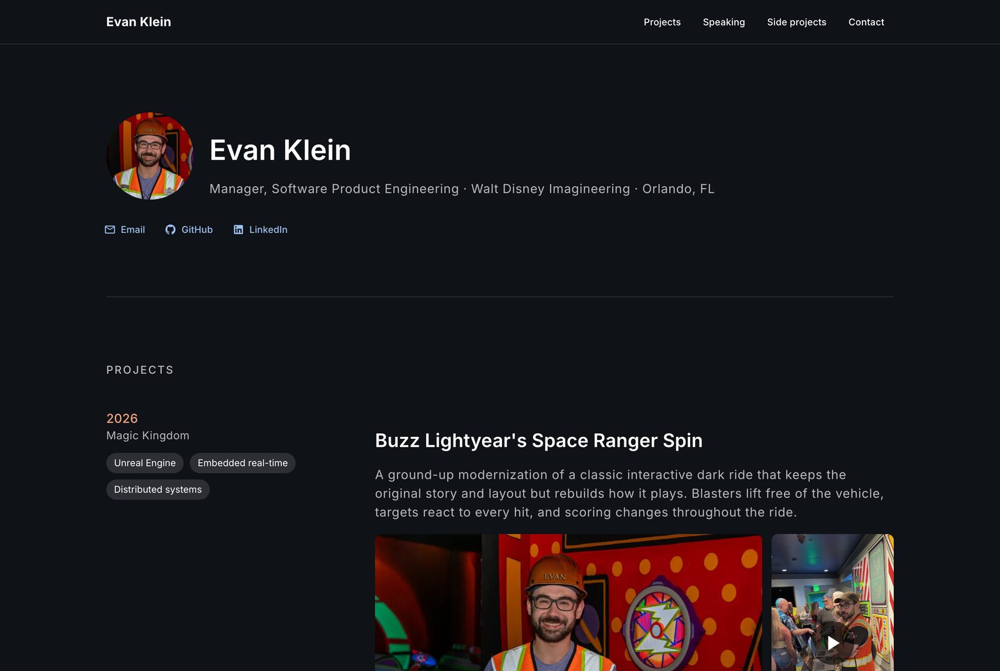

# evanklein.tech

Personal site for Evan Klein, Manager of Software Product Engineering at Walt Disney Imagineering.

[](https://evanklein.tech)

## Stack

- **Vue 3 + Vuetify 4** on **Vite**, written in TypeScript
- **Prerendered** to static HTML at build time with [vite-ssg](https://github.com/antfu-collective/vite-ssg), then hydrated in the browser, so crawlers and first paint get the full page without waiting on JavaScript
- **Hosted on GitHub Pages**, deployed by GitHub Actions on every push to `main`

## How it's put together

- **One content file.** All copy lives in [`src/data/content.ts`](src/data/content.ts): projects, speaking and press, side projects and contact details. The page renders from it.
- **SEO generated from content.** [`seo.ts`](seo.ts) is a small Vite plugin that builds the JSON-LD structured data (a `Person` graph with projects, repos and press coverage) and `sitemap.xml` from that same file, so they can't drift from what the page shows.
- **Inlined CSS.** The same plugin inlines the stylesheet into the HTML, which removes the only render-blocking request. Critical-CSS extraction was tried and dropped: it mangles Vuetify 4's nested `@layer` rules.
- **Light on third parties.** Fonts are self-hosted, icons are inlined SVG paths, and YouTube only loads when a video is clicked.

## Development

```bash
npm install
npm run dev      # local dev server
npm run build    # type-check, then prerender to dist/
npm run preview  # serve the production build locally
```

Pull requests run the build in CI, and Dependabot opens monthly update PRs.
